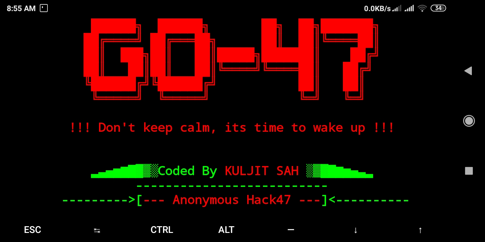

# GO-47
# Anonymous Hack47


<h1 align="center">GO-47</h1>
<p align="center">
      New advanced terminal for Termux users with simple steps
     
     
      

## About GO-47 :

GO-47 is a bash based script which modifies and changes your terminal from boring to awesome in just oneclick without any issue and without root. This tool works on both rooted Android device and Non-Rooted Android device.
[](https://github.com/anonymoushack47/GO-47/blob/master/Screenshot_2020-02-18-08-55-40-400_com.termux.jpg)

### GO-47 is available for

* Termux

* Kali Linux

### Installation and usage guide
```
pkg install git -y
```
```
git clone https://github.com/anonymoushack47/GO-47
```
```
$ ls
```
```
$ cd GO-47
```
```
$ bash go-47.sh
```

Note:- Don't delete any of the audio files from your sdcard/internal storage or else you cannot feel the terminal startup sound

### Subscribe our channel on youtube
https://www.youtube.com/channel/UClJL1InBc0Y3s6YYbmSYPFg
     
### Warning

***This tool is only for educational purpose. If you use this tool for other purposes except education we will not be responsible in such cases.***
